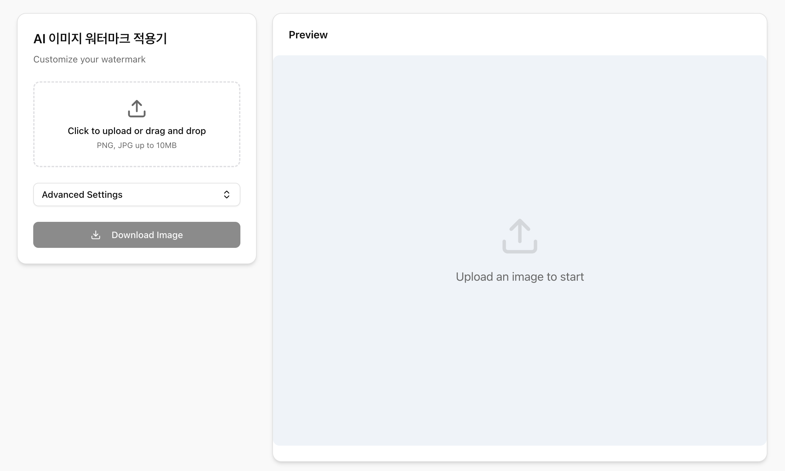

# AI 이미지 워터마크 적용기 (AI Image Watermark Generator)

클라이언트 사이드에서 안전하게 이미지에 워터마크를 추가할 수 있는 웹 애플리케이션입니다. Next.js 16과 ShadCN UI로 제작되었으며, 모바일과 데스크탑 모두에서 최적화된 경험을 제공합니다.



## 주요 기능 (Features)

- 🎨 **커스터마이징 (Customization)**: 텍스트 내용, 색상, 투명도, 배경색 등을 자유롭게 조절할 수 있습니다.
- 📐 **위치 설정 (Positioning)**: 4가지 모서리(상단 좌/우, 하단 좌/우) 중 원하는 위치에 워터마크를 배치할 수 있습니다.
- 📱 **반응형 디자인 (Responsive)**: 모바일 환경에서도 미리보기와 설정을 편리하게 이용할 수 있습니다.
- 💾 **자동 저장 (Auto-Save)**: 사용자의 설정값은 브라우저에 자동 저장되어, 재방문 시에도 그대로 유지됩니다.
- 📂 **편리한 업로드 (Drag & Drop)**: 이미지를 클릭하거나 드래그하여 손쉽게 업로드할 수 있습니다.
- 🔒 **보안 (Privacy)**: 모든 이미지 처리는 브라우저(Client-side) 내에서 이루어지며, 서버로 전송되지 않습니다.

## 기술 스택 (Tech Stack)

- **Framework**: Next.js 16 (App Router)
- **UI Library**: ShadCN UI (Radix UI based)
- **Styling**: Tailwind CSS
- **Language**: TypeScript

## 설치 및 실행 (Getting Started)

로컬 환경에서 실행하려면 다음 단계를 따르세요:

1. 레포지토리를 클론합니다.
   ```bash
   git clone https://github.com/your-username/img-watermark-generator.git
   cd img-watermark-generator
   ```

2. 의존성을 설치합니다.
   ```bash
   npm install
   # or
   pnpm install
   ```

3. 개발 서버를 실행합니다.
   ```bash
   npm run dev
   # or
   pnpm dev
   ```

4. 브라우저에서 `http://localhost:3000`을 엽니다.

## 배포 (Deployment)

Vercel을 통해 원클릭으로 배포할 수 있습니다.

[](https://vercel.com/new/clone?repository-url=https%3A%2F%2Fgithub.com%2Fyour-username%2Fimg-watermark-generator)

## 라이선스 (License)

MIT License
